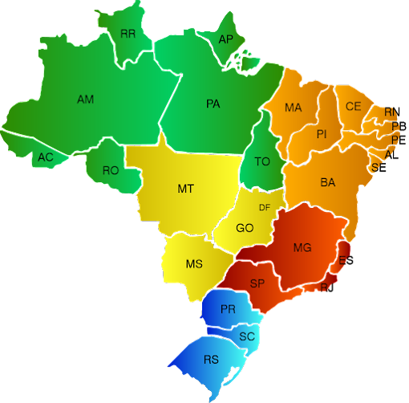

# CPFgen

A CPF generator writen in Go.

## Description

The CPF number (*Cadastro de Pessoas Físicas*; Portuguese for "Natural
Persons Register") is the Brazilian individual taxpayer registry identification.
This number is attributed by the Brazilian Federal Revenue to Brazilians and
resident aliens who, directly or indirectly, pay taxes in Brazil. It is an
11-digit number in the format *000.000.000-00*.

This program generates valid CPF numbers according to given criteria. See
program help for more details.

## Getting Started

After cloning the repository, you can run the program either with `go run ./main.go` or by compiling it with `go build` and then running `./CPFgen`.

## Usage

```shell
./CPFgen -h
Usage of ./CPFgen:
  -e	use heuristics when generating CPF
  -f int
    	output format (1: 11122233345,
    	  2: 111.222.333-45, 3: 111222333-45) (default 1)
  -l	list regions and their codes
  -n int
    	generate n random CPF numbers
  -o string
    	output results to file
  -r string
    	comma-separated list with region codes (default "0,1,2,3,4,5,6,7,8,9")
  -v	verbose
```
### Available regions

| Code | Regions |
|-------|---------|
| 0 | RS |
| 1 | DF, GO, MS, MT, TO |
| 2 | AC, AM, AP, PA, RO, RR |
| 3 | CE, MA, PI |
| 4 | AL, PB, PE, RN |
| 5 | BA, SE |
| 6 | MG |
| 7 | ES, RJ |
| 8 | SP |
| 9 | PR, SC |



## Example

Randomly generate 50000 CPFs (`-n 50000`) from São Paulo (`-r 8`) and write results
to [`output/cpf-sp.txt`](output/cpf-sp.txt).
```shell
./CPFgen -r 8 -n 50000 -o output/cpf-sp.txt
```
# Note

  - The output can easily reach the order of Gigabytes. Ensure you have enough
    disk space before saving any output.
  - When using `-o`, the **provided file will be overwritten** without confirmation.

## License

This program is licensed under GNU GPLv3. For more information, refer to
[LICENSE.txt](LICENSE.txt).
